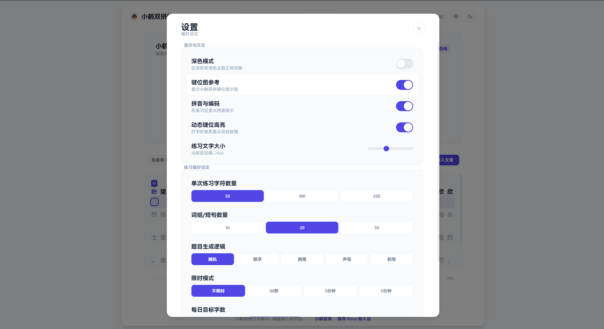
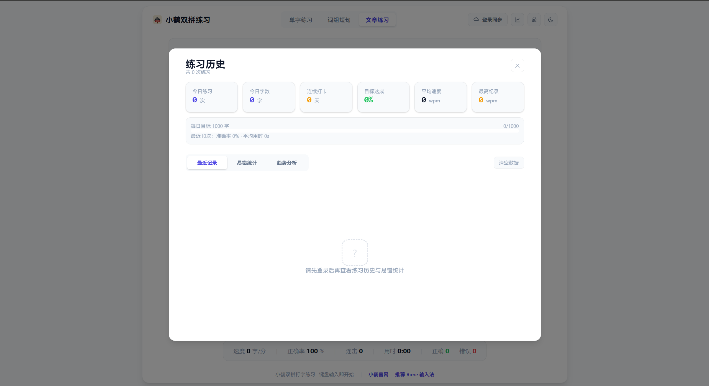

# flypy-typing

[中文](./README.md) | [English](./README.en.md)


> A web-based trainer for **Flypy (Xiaohe Shuangpin)** covering character, phrase, and article practice, with real-time stats, history review, cloud sync, and an official backend foundation.

> Flypy typing practice for characters, phrases, and articles, with analytics, mistake tracking, and email-based sync.

**Quick Links:** [Releases](https://github.com/slnlkd/flypy-typing/releases) | [Packages](https://github.com/slnlkd?tab=packages&repo_name=flypy-typing)

## Overview

`flypy-typing` is a typing practice platform for Flypy users. The current stack is **React 19 + TypeScript + Vite** on the frontend, with an **official FastAPI backend skeleton** already integrated for sync and content services.

The app can still run as a local-only frontend trainer, but when paired with the backend it also supports email verification login, settings sync, practice record sync, wrong-character sync, and cloud article loading.

This project is useful for:

- beginners learning Flypy key mappings and code patterns
- intermediate users improving speed, accuracy, and consistency
- users who want to review mistakes and train weak spots deliberately
- developers extending the content, auth, and backend service layer

## Core Capabilities

### Practice Modes

- `Character Practice` for core code memorization and accuracy training
- `Phrase Practice` for more natural rhythm and grouped input
- `Article Practice` for long-form continuous typing

### Training Strategies

- Supports `Random`, `Sequential`, and `Hard Character` style generation
- Supports focused drills for initials and finals
- Supports `60s / 180s / 300s` timed sessions
- Includes more stable logic after fixes around polyphonic context handling and hint boundary issues

### Real-Time Feedback

- Live speed, accuracy, progress, and combo metrics
- Keyboard map highlighting to reinforce Flypy key positions
- Sound feedback and volume control for typing rhythm
- Result panel with completion summary and speed level feedback

### History and Mistake Review

- Persistent practice history and frequent mistake tracking
- Recent trend viewing for speed and accuracy changes
- Wrong-character data can feed future focused practice

### Personalization

- Configurable pinyin display, font sizing, volume, dark mode, and other UI preferences
- Unified modal behavior for settings and history panels

### Cloud Features

- Email verification login
- Cloud settings sync
- Practice record sync
- Wrong-character sync
- Cloud article fetching with automatic fallback to local preset content when the backend is unavailable

## Recent Updates

This section summarizes the latest architecture and product direction rather than listing every commit verbatim.

### 1. Official backend foundation is now in place

- `feat: 初始化 FastAPI 正式后端骨架`
- The repo now includes `backend/` as the main backend entry
- The backend skeleton already covers auth, practice data, content, admin APIs, and AI placeholders
- Local integration now targets the FastAPI + Docker Compose workflow instead of the old Node prototype path

### 2. Frontend cloud sync infrastructure has landed

- `feat: 接入前端云同步基础设施`
- The frontend now includes an API client, auth state, and cloud article state
- Settings, practice records, and wrong-character data can sync with the backend
- Cloud article lists can be loaded during app startup

### 3. Login and auth UX is now exposed in the UI

- `feat: 新增登录同步入口与认证弹窗`
- A login/sync entry was added to the header
- A dedicated auth panel now handles email verification login
- After login, the app can fetch user info and remote settings automatically

### 4. Modal interaction behavior was unified

- `fix: 统一历史与设置弹窗交互行为`
- History and settings panels now follow a more consistent interaction model
- This reduces friction for future modal-style features

### 5. The old Node prototype backend has been removed

- `chore: 移除旧 Node 原型后端`
- README guidance should now follow the official backend flow
- The main backend path in this repo is `backend/`, not the old prototype service

## Preview

The repository now includes multiple screenshots. The sections below group them by user-facing workflow instead of showing a single generic preview.

### 1. Main Practice Screen


- Shows the full working layout, including top actions, keyboard map, practice area, and bottom stats bar
- Useful for understanding the overall page structure at a glance

### 2. Practice Content View


- Focuses more directly on the typing area and in-session visual feedback
- Helps readers see how the central training surface is presented during practice

### 3. Settings Panel



- Shows configuration options for training parameters, display preferences, sound, and theme-related choices
- Useful for demonstrating how much of the practice experience is customizable

### 4. History and Trend Panel



- Shows practice history, trend review, and post-session analysis content
- Highlights the longer-term feedback loop instead of only the live typing experience

### 5. Login and Cloud Sync Panel


- Shows the email verification login flow and cloud sync entry point
- Matches the current frontend-backend integration path in the repo

### UI Areas Worth Calling Out

- `KeyboardMap`: reinforces Flypy key-position memory
- `TypingArea`: the central surface for character, phrase, and article practice
- `StatsBar`: keeps speed, accuracy, progress, and combo visible during training
- `SettingsPanel`: centralizes training, display, and audio preferences
- `HistoryPanel`: supports trend review and mistake analysis after practice
- `AuthPanel`: handles email login and cloud sync-related account actions

## Quick Start

### Frontend Only

Use this path if you only want local practice and UI development.

1. Install dependencies

```bash
npm install
```

2. Start the dev server

```bash
npm run dev
```

3. Build for production

```bash
npm run build
```

4. Preview the production build

```bash
npm run preview
```

5. Run lint

```bash
npm run lint
```

### Frontend + Official Backend

Use this path to verify email login, cloud sync, and cloud article flows.

1. Install frontend dependencies

```bash
npm install
```

2. Install backend dependencies

```bash
npm run backend:install
```

3. Start backend service dependencies

```bash
npm run backend:compose
```

4. Run database migrations

```bash
npm run backend:migrate
```

5. Start the FastAPI dev server

```bash
npm run backend:dev
```

6. Start the frontend dev server

```bash
npm run dev
```

See [backend/README.md](./backend/README.md) for backend-specific details.

## How to Use

1. Choose a practice mode: character, phrase, or article.
2. Adjust settings such as generation mode, session size, timer mode, sound, and display preferences.
3. Start typing directly and monitor live speed, accuracy, progress, and combo.
4. Review the result panel, history trends, and frequent mistakes after each session.
5. Use the top-right login entry if you want email-based cloud sync across devices.

## Frontend and Backend Development

### Frontend Scripts

| Command | Description |
| --- | --- |
| `npm run dev` | Start the Vite dev server |
| `npm run build` | Run TypeScript build and generate the production bundle |
| `npm run preview` | Preview the production build locally |
| `npm run lint` | Run ESLint across the repo |

### Backend Scripts

| Command | Description |
| --- | --- |
| `npm run backend:install` | Install Python dependencies for `backend/` |
| `npm run backend:compose` | Start backend service dependencies with Docker Compose |
| `npm run backend:migrate` | Run Alembic migrations |
| `npm run backend:dev` | Start the FastAPI dev server |

### Backend Integration Notes

- Environment templates live in `backend/.env.example`
- Detailed backend instructions live in [backend/README.md](./backend/README.md)
- Swagger UI is available at `http://localhost:8000/docs`
- OpenAPI JSON is available at `http://localhost:8000/openapi.json`
- Real email verification requires SMTP configuration

## Project Structure

```text
flypy-typing/
├─ backend/                # official FastAPI backend (auth / content / practice / admin / AI placeholders)
├─ docs/                   # docs and preview assets
├─ public/                 # frontend static assets
├─ server/                 # other server-side experiments, not the current main backend entry
├─ src/
│  ├─ api/                 # frontend API client and cloud sync requests
│  ├─ components/
│  │  ├─ Auth/             # login and auth panel
│  │  ├─ KeyboardMap/      # keyboard map
│  │  ├─ Layout/           # header layout and top-level actions
│  │  ├─ Settings/         # settings panel
│  │  ├─ Stats/            # stats, result, and history panels
│  │  └─ TypingArea/       # character / phrase / article practice areas
│  ├─ data/                # static dictionary data and Flypy mappings
│  ├─ stores/              # Zustand state for typing, settings, history, auth, and articles
│  ├─ utils/               # pinyin, validation, sound, and helper utilities
│  ├─ App.tsx              # app root
│  └─ main.tsx             # entry point
├─ package.json
├─ README.en.md
└─ README.md
```

## Tech Stack

### Frontend

- React 19
- TypeScript 5
- Vite 7
- Zustand 5
- Tailwind CSS 4
- pinyin-pro

### Backend

- FastAPI
- SQLAlchemy / Alembic
- PostgreSQL
- Redis
- Celery
- Docker Compose

## Persistence and Sync

### Local Storage Keys

| Key | Description |
| --- | --- |
| `flypy-settings` | local practice settings and display preferences |
| `flypy-history` | local history and wrong-character data |
| `flypy-auth` | local auth session and cloud user state |

### Sync Behavior

- When not logged in, the app runs in local-only mode
- After login, the frontend attempts to fetch user info, remote settings, and sync local records
- Settings changes are saved back to the cloud after a short delay
- If the backend is unavailable, sync requests fail gracefully and cloud articles fall back to local preset data

## References

- Backend docs: [backend/README.md](./backend/README.md)
- Flypy mapping source: `src/data/flypy.ts`
- Flypy official site: [https://flypy.cc/](https://flypy.cc/)
- Rime input method: [https://rime.im/](https://rime.im/)

## License

This project is licensed under the [MIT License](./LICENSE).
