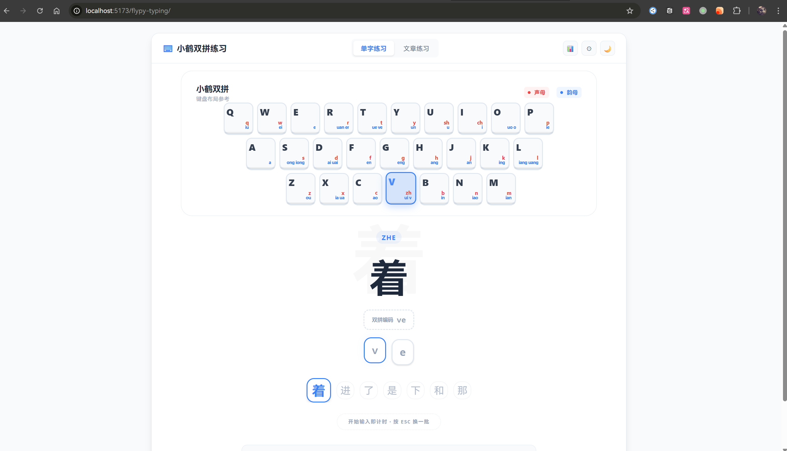

# flypy-typing

[中文](./README.md) | [English](./README.en.md)


> 一个围绕 **小鹤双拼** 打造的网页练习项目，覆盖单字、词组、文章训练，以及统计分析、历史追踪、云同步与正式后端支撑。

> 小鹤双拼打字练习：单字 / 词组 / 文章、实时统计、错字分析、邮箱登录同步。

**快速入口：** [Releases](https://github.com/slnlkd/flypy-typing/releases) | [Packages](https://github.com/slnlkd?tab=packages&repo_name=flypy-typing)

## 项目简介

`flypy-typing` 是一个面向小鹤双拼用户的练习平台，当前采用 **React 19 + TypeScript + Vite** 构建前端，并已接入 **FastAPI 正式后端骨架** 作为云同步与内容服务基础设施。

它既可以作为纯前端练习工具独立运行，也可以在联调正式后端后提供完整的账号同步体验，包括邮箱验证码登录、设置同步、练习记录同步、错字本同步，以及云端文章拉取。

适合人群：

- 想系统熟悉小鹤双拼键位和编码规则的新手
- 想提升速度、准确率和稳定性的进阶用户
- 想通过错字统计和专项练习做针对性提升的用户
- 希望继续扩展内容服务、认证体系和后台能力的开发者

## 核心能力

### 练习模式

- `单字练习`：适合记忆编码、熟悉按键和提升基础准确率
- `词组练习`：覆盖更接近日常输入的节奏与联想
- `文章练习`：用于长文本连续输入、节奏控制和稳定性训练

### 出题与训练策略

- 支持 `随机`、`顺序`、`困难字` 等常规出题方式
- 支持 `专项声母`、`专项韵母` 等针对性训练
- 支持 `60s / 180s / 300s` 限时练习，适合做速度冲刺与稳定性测试
- 支持多音字上下文判定与提示越界修复后的更稳定训练逻辑

### 实时反馈与结果分析

- 实时展示速度、准确率、进度、连击等核心指标
- 支持键位图高亮，帮助建立音节到键位的映射
- 集成音效反馈与音量调节，强化输入节奏感
- 结果面板提供速度等级、完成反馈和练习总结

### 历史记录与错字分析

- 持久化保存练习记录与高频错字数据
- 历史面板支持近期趋势查看，便于观察速度与准确率变化
- 错字统计可反向支持后续专项训练和复盘

### 个性化设置

- 支持拼音显示、字号、音量、深色模式等界面与输入偏好设置
- 支持统一的设置弹窗与历史弹窗交互行为，减少操作割裂感

### 云同步与内容服务

- 支持邮箱验证码登录
- 支持云端设置同步
- 支持练习记录同步
- 支持错字本同步
- 支持云端文章列表拉取，后端不可用时自动回退到本地预设文章

## 近期更新

以下内容基于最近一批关键提交整理，反映当前主线能力而不是完整变更日志。

### 1. 正式后端主线已建立

- `feat: 初始化 FastAPI 正式后端骨架`
- 项目新增 `backend/` 目录，作为正式业务后台入口
- 后端已预置认证、练习数据、内容题库、管理 API、AI 预留等模块骨架
- 本地联调方式已从旧 Node 原型路线转向 FastAPI + Docker Compose 方案

### 2. 前端已接入云同步基础设施

- `feat: 接入前端云同步基础设施`
- 前端新增 API 客户端、认证状态、云文章状态等基础模块
- 设置、练习记录、错字本可以与后端进行同步
- 云端文章列表可在应用启动后自动加载

### 3. 登录与认证体验已补齐

- `feat: 新增登录同步入口与认证弹窗`
- 顶部导航加入登录同步入口
- 新增认证弹窗，支持邮箱验证码登录
- 登录后可自动拉取个人信息与云端配置

### 4. 交互一致性进一步收敛

- `fix: 统一历史与设置弹窗交互行为`
- 历史记录与设置面板的打开、关闭与覆盖关系更一致
- 便于后续继续扩展更多弹窗型功能而不引入交互冲突

### 5. 旧 Node 原型后端已移除

- `chore: 移除旧 Node 原型后端`
- README 和开发说明应以正式后端方案为准
- 当前仓库的主要后端入口是 `backend/`，不是旧原型服务

## 界面预览



## 快速开始

### 仅运行前端

适合本地体验输入练习、界面与大部分本地功能。

1. 安装依赖

```bash
npm install
```

2. 启动开发服务器

```bash
npm run dev
```

3. 构建生产版本

```bash
npm run build
```

4. 本地预览构建结果

```bash
npm run preview
```

5. 执行代码检查

```bash
npm run lint
```

### 联调正式后端

适合验证邮箱登录、云同步、云端文章和正式接口。

1. 安装前端依赖

```bash
npm install
```

2. 安装后端依赖

```bash
npm run backend:install
```

3. 启动后端依赖服务

```bash
npm run backend:compose
```

4. 执行数据库迁移

```bash
npm run backend:migrate
```

5. 启动 FastAPI 开发服务

```bash
npm run backend:dev
```

6. 启动前端开发服务器

```bash
npm run dev
```

后端补充说明见 [backend/README.md](./backend/README.md)。

## 使用说明

1. 打开页面后选择练习模式：单字、词组或文章。
2. 根据目标调整练习参数，例如出题方式、数量、限时模式、音效和显示选项。
3. 直接键盘输入即可开始练习，实时查看速度、准确率、进度和连击。
4. 练习结束后查看结果面板，并结合历史记录与错字统计做复盘。
5. 如需跨设备同步，可点击右上角登录入口，通过邮箱验证码登录云端账号。

## 前后端开发说明

### 前端脚本

| 命令 | 说明 |
| --- | --- |
| `npm run dev` | 启动 Vite 开发服务器 |
| `npm run build` | 先执行 TypeScript 构建，再输出生产包 |
| `npm run preview` | 本地预览生产构建结果 |
| `npm run lint` | 执行 ESLint 检查 |

### 后端脚本

| 命令 | 说明 |
| --- | --- |
| `npm run backend:install` | 安装 `backend/` Python 依赖 |
| `npm run backend:compose` | 通过 Docker Compose 启动后端依赖服务 |
| `npm run backend:migrate` | 执行 Alembic 数据库迁移 |
| `npm run backend:dev` | 启动 FastAPI 开发服务 |

### 后端联调要点

- 环境变量模板位于 `backend/.env.example`
- 详细启动说明位于 [backend/README.md](./backend/README.md)
- Swagger 文档默认地址为 `http://localhost:8000/docs`
- OpenAPI 描述默认地址为 `http://localhost:8000/openapi.json`
- 邮箱验证码发送依赖 SMTP 配置，未配置时无法完成真实邮件登录链路

## 项目结构

```text
flypy-typing/
├─ backend/                # FastAPI 正式后端（认证 / 内容 / 练习 / 管理 / AI 预留）
├─ docs/                   # 文档与预览资源
├─ public/                 # 前端静态资源
├─ server/                 # 其他服务端实验目录，非当前主线后端入口
├─ src/
│  ├─ api/                 # 前端 API 客户端与云同步请求
│  ├─ components/
│  │  ├─ Auth/             # 登录与认证弹窗
│  │  ├─ KeyboardMap/      # 键位图
│  │  ├─ Layout/           # 顶部布局与入口操作
│  │  ├─ Settings/         # 设置面板
│  │  ├─ Stats/            # 统计、结果、历史面板
│  │  └─ TypingArea/       # 单字 / 词组 / 文章练习区
│  ├─ data/                # 静态字典与小鹤映射
│  ├─ stores/              # Zustand 状态（输入、设置、历史、认证、文章）
│  ├─ utils/               # 拼音处理、输入校验、音效等工具
│  ├─ App.tsx              # 应用主入口
│  └─ main.tsx             # 渲染入口
├─ package.json
├─ README.en.md
└─ README.md
```

## 技术栈

### 前端

- React 19
- TypeScript 5
- Vite 7
- Zustand 5
- Tailwind CSS 4
- pinyin-pro

### 后端

- FastAPI
- SQLAlchemy / Alembic
- PostgreSQL
- Redis
- Celery
- Docker Compose

## 数据持久化与同步说明

### 本地存储键

| 键名 | 说明 |
| --- | --- |
| `flypy-settings` | 本地练习设置与展示偏好 |
| `flypy-history` | 本地练习历史与错字统计 |
| `flypy-auth` | 本地登录态与云端用户会话 |

### 同步行为

- 未登录时，应用以本地模式运行
- 登录后，前端会尝试拉取用户信息、云端设置并同步本地记录
- 设置变更会在短暂延迟后自动保存到云端
- 后端不可用时，云同步失败会提示用户，云文章列表回退到本地预设数据

## 路线与说明入口

- 正式后端说明：[backend/README.md](./backend/README.md)
- 题库与编码映射：`src/data/flypy.ts`
- 小鹤双拼官网：[https://flypy.cc/](https://flypy.cc/)
- Rime 输入法：[https://rime.im/](https://rime.im/)

## License

本项目采用 [MIT License](./LICENSE) 开源。
